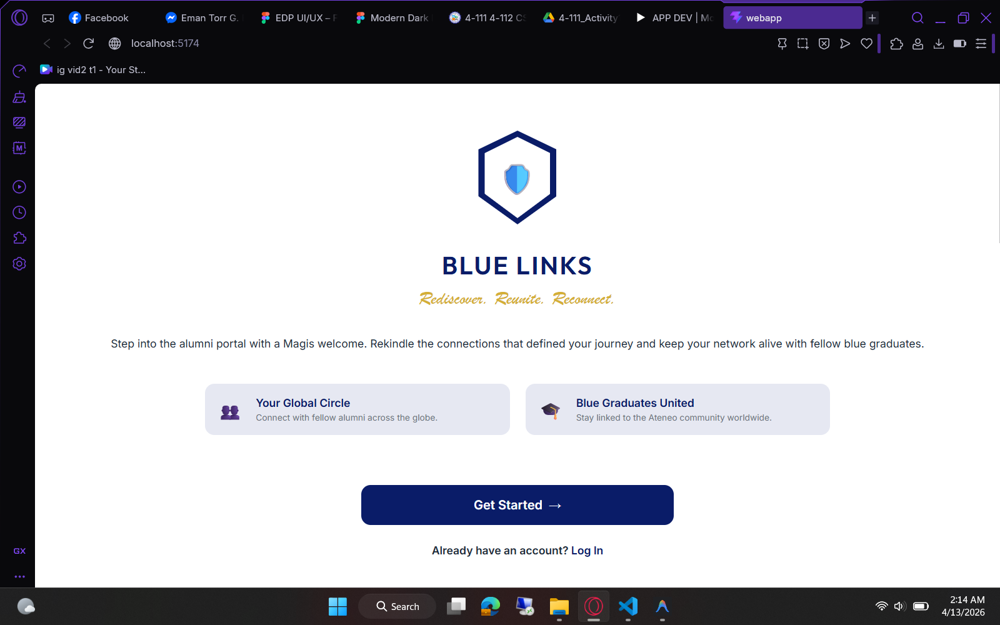
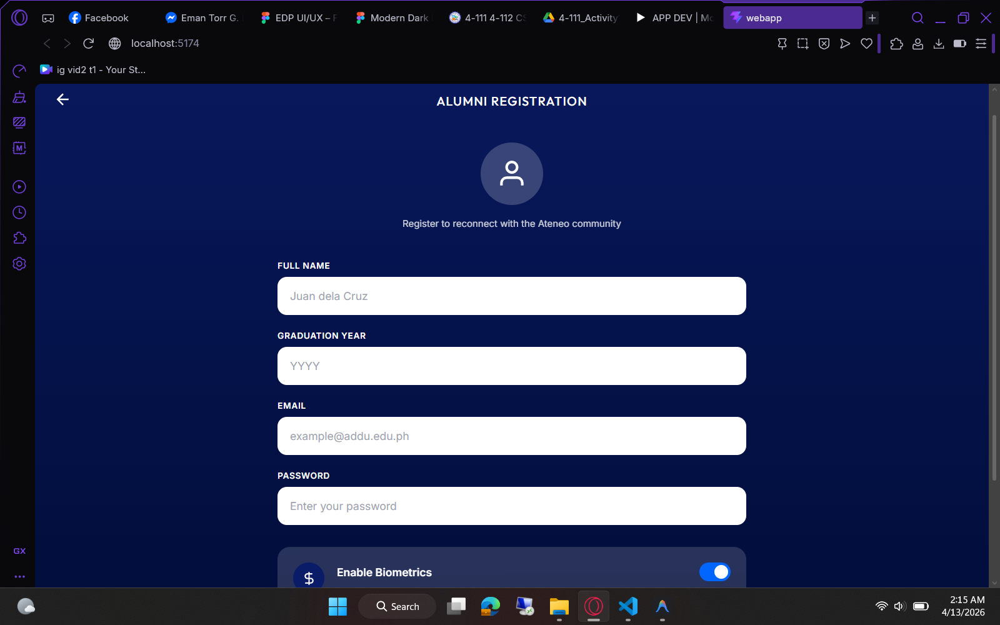
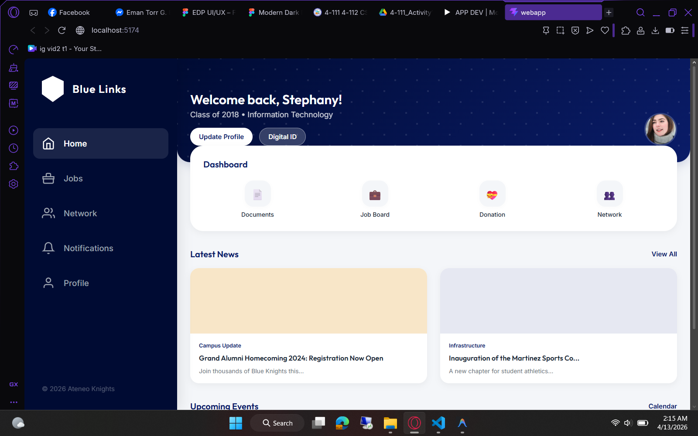
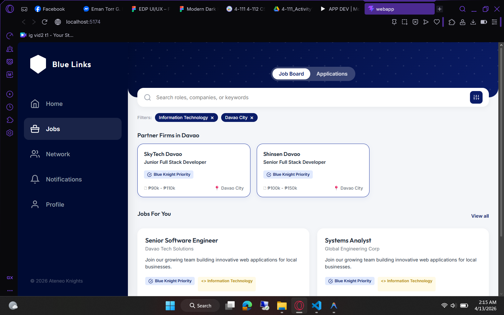
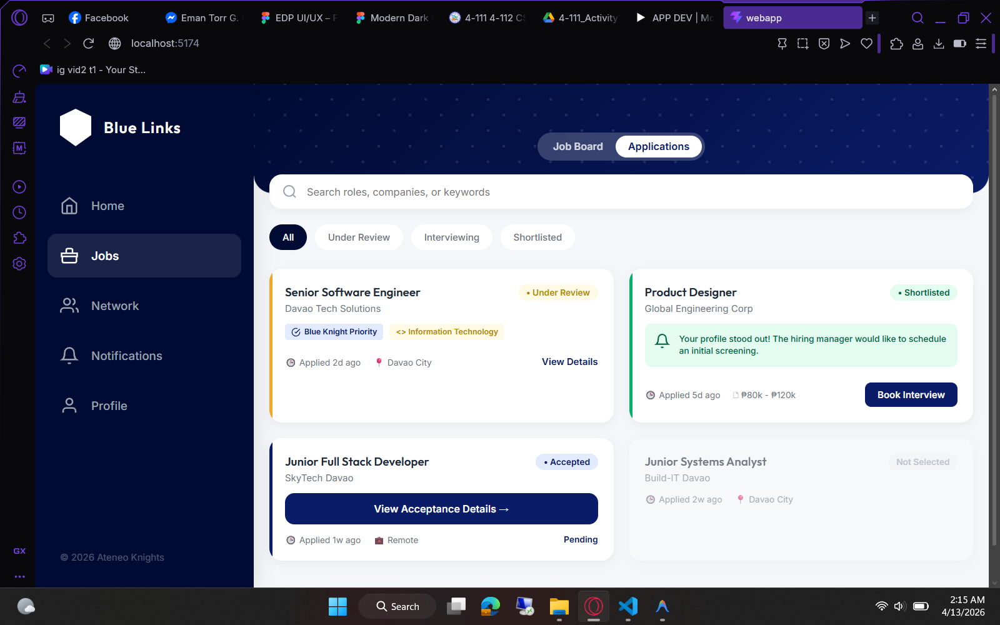
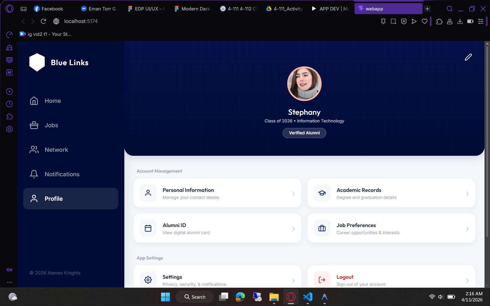

# Pidoy

**Framework:** Svelte JS (via Vite)

**Module:** Job Posting

**AI Tools:** Antigravity

**Prompt:** turn these into a web app in a web design using Svelte JS
Create this program...

## Installation 

1. **Install Node.js:** 
2. **Clone the Repository:**
   ```bash
   git clone <your-repository-url>
   cd <repository-directory>
   ```
   *(If you downloaded a ZIP file instead, extract it and navigate into the folder via your terminal).*
3. **Install Dependencies:**
   Run the following command to download all required packages:
   ```bash
   npm install
   ```
4. **Run the Development Server:**
   Start the local development environment:
   ```bash
   npm run dev
   ```
5. **View the App:**
   Open your browser and navigate to the local server URL provided in your terminal.


## Screenshots

### Landing Page


### Alumni Registration


### Dashboard


### Jobs Board


### Job Applications


### Profile Page

